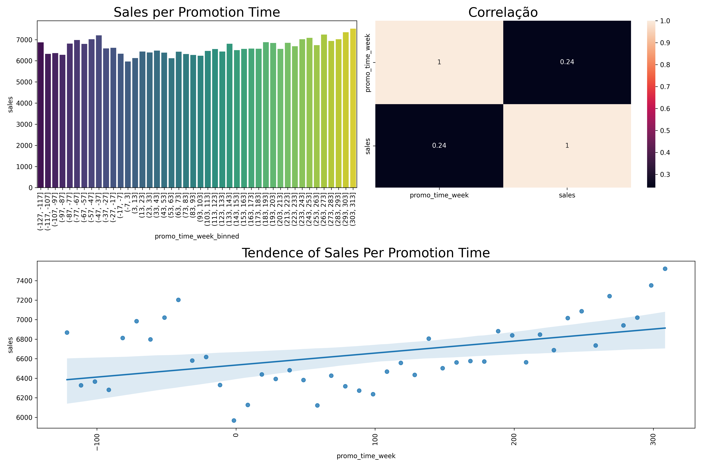
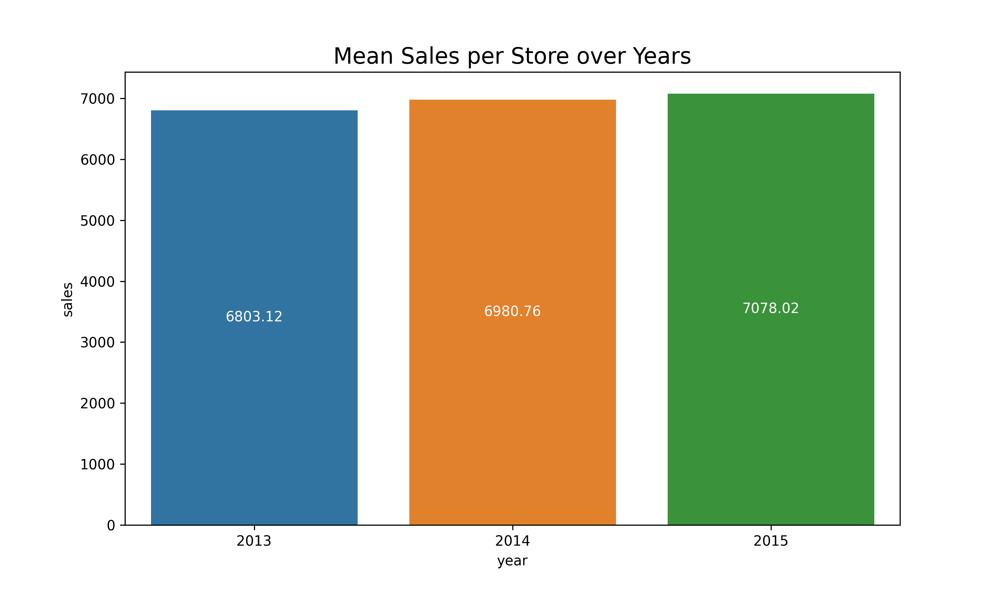

# Rossmann Predict Sales 

 

## O Problema de Negócio 

- O CFO (Chief Financial Officer) da Rossmann pretende fazer uma reforma em todas as unidades da rede, para isso, uma parcela do faturamento de cada loja deverá ser destinada para reforma da mesma nas próximas 6 semanas
- Assim, a fim de iniciar o processo de reformas, o CFO solicitou uma previsão de vendas de cada uma das unidades da Rossmann para as próximas 6 semanas para ter uma maior previsibilidade das receitas de cada loja e poder alocar os recursos de forma mais eficiente

## Solução Esperada

1. Resposta à questão de negócio:
    - A previsão de vendas de cada uma das unidades Rossmann
2. Formato
    - O valor total da previsão de vendas de cada unidade Rossmann solicitada para as próximas 6 semanas
3. Local
    - [Bot no Telegram](https://t.me/rossmann42_bot)

## Planejamento da Solução

### Etapas da Solução

1. **Questão de Negócio**
2. **Entendimento do Negócio**
3. **Coleta dos Dados**
    1. Entradas (fontes de dados)
        1. Kaggle: [https://www.kaggle.com/c/rossmann-store-sales](https://www.kaggle.com/c/rossmann-store-sales)
4. **Limpeza dos Dados**
    1. Descrição dos Dados
    2. Filtragem dos Dados
    3. Fillout NA
    4. Feature Engeneering
5. **Exploração dos Dados**
    1. Teste de Hipóteses
6. **Modelagem dos Dados**
    1. Preparação dos dados
    2. Rescaling e Enconding
    3. Seleção de Features
7. **Algoritmos de Machine Learning**
    1. Teste de algoritmos candidatos
8. **Avaliação do Algoritmo**
    1. Cross Validation
    2. Avaliação do erro dos algoritmos escolhidos
    3. Fine Tuning
9. **Deploy do Modelo em Produção**
    1. Criar API para consumo dos dados do modelo
    2. Fazer deploy da API em nuvem
    3. Criar APIs para consulta de dados no Telegram
    4. Testar Bot Telegram

## Análise Exploratória dos Dados

H1. Lojas com maior sortimentos deveriam vender mais.

- Verdadeiro. Lojas com maior diversidade de produtos vendem 18% mais em média que as lojas com diversidade estendida

 
H4. Lojas com promoções ativas por mais tempo deveriam vender mais.

- Verdadeiro. Lojas com promoções ativas por mais tempo possuem um tendencia de crescimento nas vendas ao longo das semanas

 
H9. Lojas deveriam vender mais ao longo dos anos.

- Verdadeiro ao longo dos anos, o crescimento médio das vendas é de 2%

 
H11. Lojas deveriam vender mais depois do dia 10 de cada mês.

- Falso, após o dia 10, as vendas são em média 8% menores

 
H12. Lojas deveriam vender menos aos finais de semana.

- Falso, as vendas nos finais de semana são em média 22,5% maiore que nos dias úteis

 

## Resultados de Negócio

## Performance total do modelo
    
Abaixo, podemos comparar 3 cenários principais, a soma real das vendas de todas as lojas durantes as 6 semanas, a soma das vendas previstas pelo modelo e a soma das vendas no cenário em que a média de vendas de cada loja é generalizda por 6 semenas

| Sum of Sales | Baseline (Mean Model) | ML Model 
| --------- | ---------- | ----------- 
| R$ 289.571.750 | R$ 324.608.344 | R$ 283.041.088 
    
Com essa comparação podemos perceber que a utilização de um modelo se justifica frente a utilização da média para a projeção a receita futura
 

## Performance do Negócio
    
Com base no erro calculado pelo modelo, podemos traçar cenários pessimistas e otimistas a fim de dar maiores possibilidades ao time de negócio

Segue abaixo exemplos de algumas lojas:

| Store     | Sales      | ML Predict | Worst Scenario | Best Scenario | MAE | MAPE 
| --------- | ---------- | ----------- | ----------- | ----------- | ----------- | ----------- 
|251	|R$ 690.220,0     |R$ 650.210,0 	|R$ 648.380,0 	|R$ 652.040,0 	|R$ 1.830,0 	|0.09
|192	|R$ 487.998,0     |R$ 400.844,0 	|R$ 398.374,0 	|R$ 403.313,0 	|R$ 2.469,0 	|0.18
|178	|R$ 370.073,0     |R$ 423.960,0 	|R$ 352.799,0 	|R$ 354.543,0 	|R$ 871,0 	    |0.08
|34	    |R$ 309.543,0     |R$ 285.755,0 	|R$ 285.083,0 	|R$ 286.428,0 	|R$ 672,0 	    |0.07

 

## Performance do Modelo:
O modeo apresentou uma performance satisfatórias com um MMAPE de 10% aproximadamente

 

 