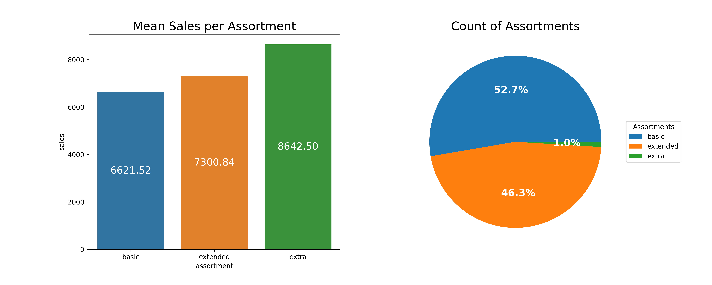
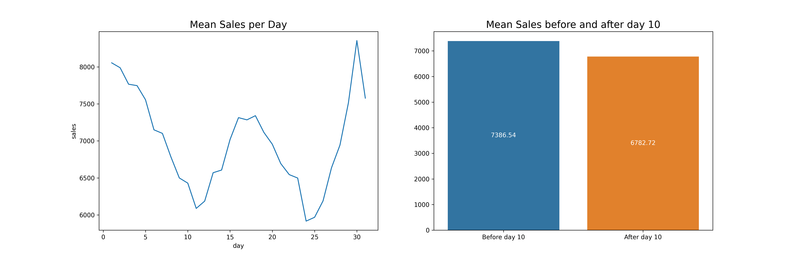
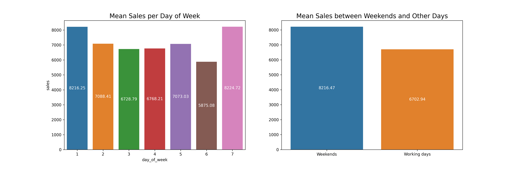

# Rossmann Predict Sales 

 

# O Problema de Negócio 

O CFO (Chief Financial Officer) da Rossmann pretende fazer uma reforma em todas as unidades da rede, para isso, uma parcela do faturamento de cada loja deverá ser destinada para reforma da mesma nas próximas 6 semanas

Assim, a fim de iniciar o processo de reformas, o CFO solicitou uma previsão de vendas de cada uma das unidades da Rossmann para as próximas 6 semanas com o objetivo de ter uma maior previsibilidade das receitas de cada loja e poder alocar os recursos de forma mais eficiente

 

# Estratégia de Solução

A estratégia de solução adotada neste projeto se baseia no método CRISP-DM (*Cross Industry Standard Process for Data Mining*). Esta é uma metodologia cíclica e flexivel voltada para resolução de problemas que envolvem grande volume de dados que permite a entrega rápida de valor para os times de negócio

 

 

## _1. Questão de Negócio_

Como citado a cima, foi entendido que o problema apresentado pelo time de negócios é a dificuldade em prever o faturamento das lojas para as próximas semanas, para isso, foi solicitado um projeto para a previsão de vendas de todas as unidades Rossmann

 

## _2. Entendimento do Negócio_

Procurando entender a raiz deste problema, em contato com o CFO, foi entendido que o que motivou a solicitaçao de uma previsão de vendas foi um projeto da sua área referente à reforma das unidades Rossmann. 

Esse projeto pretende alocar uma parte do faturamento das lojas para a realização dessas reformas e, dada a dificuldade encontrada pelo time em prever o faturamento das lojas, foi solicitado aos cientistas de dados uma previsão de vendas.

 

## _3. Coleta de Dados_

Neste cenário fictício, nossa fonte de dados é um [arquivo .csv de uma competição do Kaggle](https://www.kaggle.com/c/rossmann-store-sales), mas poderia ser do banco de dados da empresa, um conjunto de planilhas dentre outras fontes. 

 

## _4. Limpeza dos Dados_

Após a coleta dos dados inicou-se a etapa de limpeza dos dados. Essa etapa abrangeu alguns tópicos como:

- **_Descrição dos dados_**. Então, foram checados os tipos das váriáveis disponíveis no conjunto de dados e transformados para os tipos mais convenientes.

- **_Tratamento dos valores nulos_**: Foi iniciado o tratamento dos valores nulos do conjunto. Para isso, um conjunto de premissas foi assumido e podem ser conferidos em mais detalhes no notebook deste projeto

- **_Feature Engeneering_**: Com o objetivo que facilitar a futura etapa de análise exploratória de dados, foram criadas uma série de features baseadas nas variáveis já presentes no dataset. Nessa etapa, a ideia é deixar as variáveis explicitas e de fácil acesso para as análises que serão feitas ao longo do projeto

- **_Filtragem dos dados_**: Por último, foram retiradas variáveis tidas como irrelevantes para nosso projeto, como por exemplo dos dias em que as loja estavam fechadas. Além disso, foram excluídas variáveis que não estariam disponíveis no momento da predição como por exemplo o número de clientes. 

 

## _5. Análise Exploratória dos Dados_

Com o objetivo de entender como as variáveis impactam o fenômeno de vendas e qual a intensidade desse impacto, o time de negócios construiu uma lista de hipóteses que então serão colocadas à prova pelo time de dados. 

Abaixo é exibido algumas das hipóteses e sua posterior validação ou invalidação pelos testes realizados.

**H1**. Lojas com maior sortimentos deveriam vender mais.

- Verdadeiro. Lojas com maior diversidade de produtos vendem 18% mais em média que as lojas com diversidade estendida

 

**H11**. Lojas deveriam vender mais depois do dia 10 de cada mês.

- Falso, após o dia 10, as vendas são em média 8% menores

 

**H12**. Lojas deveriam vender menos aos finais de semana.

- Falso, as vendas nos finais de semana são em média 22,5% maiore que nos dias úteis

 

## _6. Modelagem dos Dados_

Uma vez que o aprendizado dos algoritmos de machine learning é facilidado com dados números e na mesma escala, foram aplicadas técnicas de Rescaling, Encoding e Transformation a fim de preparar os dados para o treinamento do modelo de machine learning.

### _6.1. Variáveis Numéricas_
Como a maioria das variáveis númericas do conjunto não possuem uma distribuição normal, foram aplicados métodos de Rescaling.
- Para variáveis que possuiam **outliers muito fortes**, optamos pela utilização do **RobustScaler** enquanto que para as demais variáveis, foi utilizado o **MinMax Scaler**

### _6.2. Variáveis Categóricas_

Para variáveis como _store_type_ e _assortment_, que possuem natureza categórica, foi utilizado Label Enconding

### _6.3. Transformação de Grandeza_

Como nossa variável reposta, vendas, não possui uma distribuição normal, para facilitar a aprendizagem do algoritmo foi aplicada uma transformação do tipo logaritma

### _6.4. Transformação de Natureza_ 

A fim de respeitar a natureza cíclica das variáveis temporais como dia, dia da semana, semana e mês foram aplicadas transformações clicicas do tipo seno e cosseno

### _6.5. Seleção de Features_

Por fim, foi utilizado o algoritmo Boruta com a finalidade de identificar as features com maior relevância para o modelo. As variáveis indicadas pelo Boruta como sendo as melhores foram as escolhidas para o treinamento do modelo.

Dessa forma, foram desconsideradas as variáveis abaixo:

    is_promo
    school_holiday
    state_holiday_christmas
    state_holiday_easter_holiday
    state_holiday_public_holiday
    state_holiday_regular_day
    year

 

## _7. Algoritmos de Machine Learning_

### _7.1. Premissas_

Dado a questão de negócio apresentada, temos então um problema de regressão uma vez que a variável resposta deve ser um valor real (no nosso caso, o valor das vendas de cada loja)

Assim, foram realizados testes com 4 algoritmos onde o com melhor performance foi selecionado para o modelo
- Uma vez que ainda não sabemos se a natureza do fenômeno de venda é linear ou não linear, selecionamos 2 algoritmos lineares e 2 não lineares. Além disso, utilizamos o modelo de média como baseline de comparação para os modelos

### _7.2. Time Series Cross Validation_

Os algoritmos foram avaliados utiliando a técnica de cross validation que pode ser ilustrada na imagem abaixo

 

De todo o conjunto de dados disponível, é separado uma parcela para treino e outra para teste e então a performance é avaliada. 
- Em uma segunda iteração, é utilizada outra parcela dos dados para treino e outra para teste. 
- Em uma terceira iteração, as parcelas de treino e validação são modificadas novamente e assim sucessivamente, até que todo o conjunto de dados seja utilizado. 

Esse processo é importante para que avaliemos o modelo sobre várias perspectivas diferentes, apresentando um resultado mais fidedigno da sua real performance

### _7.3. Performances os Algoritmos_

Aplicando então a técnica de Cross Validation Time Series nos algoritmos escolhidos, obtermos os seguintes resultados:
 

| Model | MAE | MAPE | RMSE
| --------- | ---------- | ----------- | -----------
Linear Regression	| 1940.46 +/- 97.24	| 0.3 +/- 0.02	| 2735.18 +/- 194.98
Lasso	| 1957.62 +/- 140.52	| 0.29 +/- 0.0	| 2828.15 +/- 232.95
Random Forest	| 747.02 +/- 133.64	| 0.11 +/- 0.02	| 1126.63 +/- 203.71
XGBooster	| 901.14 +/- 90.25	| 0.13 +/- 0.01	| 1308.94 +/- 142.96

 

Apesar do algoritmo Random Forest ter tido o melhor desempenho, algoritmo escolhido para este primeiro ciclo do CRISP foi o XGBoost. Isso se deve ao fato deste algoritmo ser mais enxuto que o Random Forest. 

Isso tornará mais fácil o deploy deste modelo além de poupar espaços no servidores, o que é um requisito importante para esse projeto

 

## _8. Avaliação do Algoritmo_
### _8.1. Performance do Negócio_

Após a escolha do nosso algoritmo, somos capazes agora de analisar sua performance do modelo sobre o ponto de vista de negócio
    
Abaixo, podemos comparar 3 cenários principais:
1. A soma real das vendas de todas as lojas durantes as 6 semanas
2. A soma das vendas no cenário em que a média de vendas de cada loja é generalizda por 6 semenas
3. A soma das vendas previstas pelo modelo

| Sum of Sales | Baseline (Mean Model) | ML Model 
| --------- | ---------- | ----------- 
| R$ 289.571.750 | R$ 324.608.344 | R$ 283.041.088 
    
Com essa comparação, podemos perceber que a utilização de um modelo se justifica frente a utilização da média para a projeção a receita futura uma vez que o desvio do modelo foi significativamente menor

### _8.2. Possíveis Cenários_
    
Com base no erro calculado pelo modelo, podemos traçar cenários pessimistas e otimistas a fim de dar maiores possibilidades de decição ao time de negócios

Segue abaixo exemplos de cenários em algumas lojas:

| Store     | Sales      | ML Predict | Worst Scenario | Best Scenario | MAE | MAPE 
| --------- | ---------- | ----------- | ----------- | ----------- | ----------- | ----------- 
|251	|R$ 690.220,0     |R$ 650.210,0 	|R$ 648.380,0 	|R$ 652.040,0 	|R$ 1.830,0 	|0.09
|192	|R$ 487.998,0     |R$ 400.844,0 	|R$ 398.374,0 	|R$ 403.313,0 	|R$ 2.469,0 	|0.18
|178	|R$ 370.073,0     |R$ 423.960,0 	|R$ 352.799,0 	|R$ 354.543,0 	|R$ 871,0 	    |0.08
|34	    |R$ 309.543,0     |R$ 285.755,0 	|R$ 285.083,0 	|R$ 286.428,0 	|R$ 672,0 	    |0.07

 

### _8.3. Performance do Modelo_

Uma visão geral da performance do modelo e da magnitude do seu erro intínseco pode ser visualizada no gráfico abaixo

- erro_rate = predictions/sales
- error = sales - predictions

 

 

## _9. Modelo em Produção_

Com o modelo já selecionado, treinado e avaliado, chegou a hora de coloca-lo em produção. Para isso, optamos por disponibilizar as predições do projeto de forma online através do aplicativo de mensagens Telegram.

Neste aplicativo, o usuário deverá informar o ID da loja a qual deseja obter a previsão de vendas nas próximas 6 semanas para um bot criado no Telegram. Assim, o bot retornará uma mensagem com a previsão

Para a realização dessa tarefa, foi necessário criar duas APIs cujas estruturas serão detalhadas a seguir

### _9.1 API de Consulta de Previsão (Handler.py)_

Essa API será responsável por retornar a previsão de vendas com base nos dados informaos sobre a loja

Para que a previsão seja feita, é necessário informar à API os atributos da loja no dia desejado como assortment, store_type, data e etc. Com base nessas informações o arquivo **_Handler.py_** carrega o modelo treinado, modela os dados aplicando as transformações e rescalings e então realiza a predição. 

Como resposta a essa consulta, é retornado o mesmo conjunto de dados de entrada da API no formato json acrescido de um elemento que informa o valor da previsão das vendas para o(s) dia(s) solicitado(s)

A figura abaixo procura ilustrar o funcionamento desse processo

 

### _9.2 API de Mensagens Telegram (Rossmann.py)_

Esta API será responsável pela comunicação com o usuário final, gerenciando as mensagens de boas vindas, de erro e de respostas às solicitações de previsão

Uma vez informa pelo usuário o ID da loja a qual deseja a previsão, o arquivo [Rossmann.py](http://Rossmann.py) carrega os dados de atributos da loja que agora estão em produção (usuário não precisa mais informa-los), realiza alguns tratamentos, o transforma seu formato para json e então realiza uma consulta na API apresentada anteriormente, a handler.py. 

Essa API, como informado, retorna um json com o dados de entrada acrescido do valor da previsão de cada uma das lojas. Por fim, o **_Rossmann.py_** transforma esse json, soma as predições e informa o usuário por meio de uma mensagem, o valor total das previsões de venda para as próximas 6 semanas

A figura abaixo busca ilustrar esse processo por completo

### _9.3 Bot Telegram_

Ao final de todo o processo temos o modelo em produção em pleno funcionamento. Você pode acessar o bot do telegram abaixo através [deste link](https://t.me/rossmann42_bot)

 

 